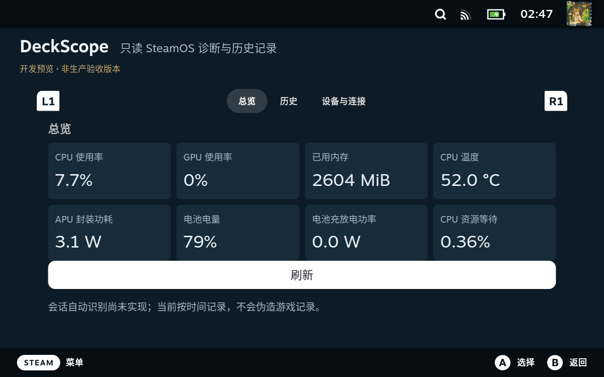

# DeckScope 真机功能验收记录

**日期：2026-09-12，UTC+8，02:11–02:47。代码版本：`2bb2daa`。作者：Manus AI。**

## 结论

**当前开发预览已在本台 Steam Deck OLED 上通过本轮功能性验收。** 真实指标接口、历史查询、磁盘记录、设置、隐私遮罩、总览、历史、设备页、QAM 入口及 monitor 异常恢复均已执行。验收发现的五项问题已修复并再次侧载。最后一轮完整回归通过 Zig 21 项、Python 23 项（ReleaseSmall 与 ReleaseSafe 分别运行）及前端 5 项测试，类型检查与构建也通过。[1] [2]

这个结论不等于生产发布认证。此次未执行真实休眠/唤醒、断网/网卡切换、实体手柄硬件测试、其他机型或长期运行测试。指标来源与部分单位已经核对，但没有把所有数值与同步采样的独立基准逐项比较。[1]

## 环境与方法

| 项目 | 实际环境与范围 |
| --- | --- |
| 硬件 | Steam Deck OLED，DMI Galileo，8 个逻辑 CPU |
| 系统 | SteamOS 3.8.16，Build 20260716.1 |
| 内核 | `6.16.12-valve24.5-1-neptune-616-gb2f7cfe85e45` |
| Decky | v3.2.8 |
| 后台验收 | 已安装插件的真实 Decky RPC；不另起假 bridge 冒充生产链路 |
| UI 验收 | Steam CEF 的大屏与 QuickAccess 视窗；DOM 操作和方向键/确认键事件 |
| 故障注入 | 仅终止本插件的 monitor；没有关闭网络、修改系统功耗或杀其他插件 |
| 参考工具 | 复用相邻 `decky-music` 的 `decky-dev`、`steam-cdp` skill 及 CDP 脚本；未修改该项目 |

UDS 指 UNIX domain socket，是 bridge 与 Zig monitor 的本机通信通道。CRC32 是本项目历史文件使用的校验和。后台查询通过现有 `DeckyBackend.call` 路由完成，没有调用会替换插件事件监听表的重新连接接口。[3]

## 功能验收结果

| 检查项 | 结果 | 证据与限制 |
| --- | --- | --- |
| 真实指标 | 通过读取与动态更新检查 | CPU、GPU、内存、温度、APU 功率、PSI、磁盘与网络等字段可读；采样计数和 UTC 时间推进 |
| 来源与单位 | 部分对照通过 | 温度、频率、APU 功率、电池状态与 proc/sysfs 来源核对；内存按二进制 MiB 换算；并非所有动态数值的同步精度验证 |
| 电池功率 | 当前供电状态通过 | BAT1 没有 `power_now`，存在 `current_now` 与 `voltage_now`；当前 Not charging、0 µA，修复后显示 0.0 W；正负充放电分支另由本地测试覆盖 |
| 历史查询 | 通过 | CPU/内存有真实记录，`max_points` 有界；UI 成功切换内存与 7 d 范围 |
| 七天范围的含义 | 仅查询控件通过 | 图中只显示已经存在的约数十分钟记录，不代表已录满七天或完成七日保留验收 |
| 历史落盘 | 通过当前文件检查 | `20707.dscp` 共 5,280 字节、41 条记录；文件头、全部记录 CRC32 与 0600 权限通过独立读取校验 |
| 重启恢复 | 通过已落盘数据恢复 | 故障后恢复旧分钟记录；最后一轮故障注入从内存 30 条恢复为磁盘 29 条，未 flush 的 1 条没有被冒充为持久化成功 |
| 实时订阅 | 通过 | 总览/QAM 开启实时推送；QAM 关闭、切入历史或全部 UI 关闭后关闭推送，采样计数仍推进 |
| 进程异常恢复 | 修复后通过 | monitor 退出约 3 秒后，后台重新采样、`live_push=true`，实际页面数值变化，无需重新进入页面 |
| 采样设置 | 通过 RPC 与 UI | 方向键打开菜单并选中 2 s；后台和持久设置回读一致；0 间隔返回 `invalid_request`；结束恢复 1 s |
| 隐私遮罩 | 通过 UI | 确认键关闭后地址出现，再打开后遮罩恢复；验收结束保持开启 |
| 摘要复制 | 修复后通过 | 使用按钮所在文档的剪贴板；界面显示“已复制”；未读取用户原有剪贴板内容 |
| 总览布局 | 修复后通过 | 八项指标、刷新按钮及说明在大屏可见；没有总览嵌套滚动区 |
| 设备页焦点 | 通过模拟输入 | 方向键到达开关、下拉框、复制和刷新，原生滚动区自动滚动；原生 A/B 提示可见 |
| QAM 入口 | 通过模拟输入 | 方向键到达“打开 DeckScope”，确认键从 Steam 主页面进入实际插件大屏 |
| 英文与畸形事件 | 本地测试通过 | 未切换整台 Steam 的语言，也没有把本地守卫测试写成真机异常事件注入 |

以上结果的精简原始字段、版本、记录数、文件哈希和截图哈希保存在 [机器可读证据](acceptance/evidence.json)。完整工作日志仍保留在项目 `.work/`，没有装入插件 ZIP。[1]

## 本轮发现并修复的问题

| 问题 | 原因与修复 | 验证 |
| --- | --- | --- |
| 电池充放电功率缺失 | OLED 未提供 `power_now`；增加电流乘电压的溢出安全回退，并公开来源 | 真实 Not charging 状态与单元/夹具测试 |
| NVMe 温度读取过慢 | 单次 NVMe sysfs 读取实测约 8 ms；改为 30 秒单调时间缓存，公开缓存年龄 | 来源读取计时、缓存集成测试、真实状态字段 |
| 重启后页面停更 | bridge 在每次启动时强制关闭实时推送；改为保留仅内存中的消费者意图 | 修复前后同类终止注入，比较后台状态和实际页面文本 |
| 总览裁切与双层滚动 | 页面外层和 Tabs 同时滚动；改为 flex 约束下的单一原生滚动区及四列总览 | 原始截图、DOM 滚动尺寸与方向键操作 |
| 复制摘要失败 | 插件代码运行于失焦的 SharedJSContext；改用实际渲染元素的 owner document | 主窗口/共享窗口焦点与权限对照，最终“已复制”状态 |

电池估算采用 `abs(µA) × µV / 10^9` 得到 mW，并按充电/放电状态决定符号。它不是整机或墙上功耗。NVMe 历史中的连续值可能来自同一缓存读数，不应解释为每秒重新测温。慢刷新仍在单线程中执行，仍可能产生延迟峰值。[3]

三个代码回退点分别为 `e868c9a`（原生采集）、`4d8abed`（重启订阅）和 `2bb2daa`（UI 与剪贴板）。修复代码已经侧载。文档与证据另外提交，不改变已部署代码。

## 性能观察，不作为发布预算结论

| 观察窗口 | 样本数 | 累计采样耗时 | 平均耗时 | 最大耗时 |
| --- | ---: | ---: | ---: | ---: |
| NVMe 缓存前 | 698 | 11,938,183 µs | 17.10 ms | 26.932 ms |
| NVMe 缓存后的一段短观察 | 39 | 74,526 µs | 1.91 ms | 17.865 ms |

两个窗口的长度和 UI 活动不同，因此不能据此给出严格 A/B 加速比。这里测量的是一次采样的墙钟耗时，不是 CPU 占用率，也不是 P99。独立来源计时表明 NVMe 温度读取是重要慢来源，但不是所有耗时的完整归因。[1]

最终一次进程快照为单线程、RSS 376 kB、虚拟内存 3,244 kB。固定容量历史缓冲尚未全部写满，不能把这个短时 RSS 当作七天满容量稳态。原生发布文件为 127,640 字节，约 124.6 KiB，静态 x86_64 ELF。[1]

## 原始截图

下图为最终总览的原始 CEF 大屏截图，未重绘或生成。QAM 文件是它自身视窗的原始截图，不是与主屏合成的展示图。

| 场景 | 原始截图 |
| --- | --- |
| CPU 历史 | [history.png](acceptance/history.png) |
| 内存与七天查询范围 | [history-memory-week.png](acceptance/history-memory-week.png) |
| 设备与隐私遮罩 | [device.png](acceptance/device.png) |
| 复制成功与下方摘要 | [clipboard.png](acceptance/clipboard.png) |
| QAM 的大屏入口焦点 | [qam.png](acceptance/qam.png) |

## 安装身份与收尾

| 产物 | SHA-256 |
| --- | --- |
| `bin/deckscope-monitor` | `f5bbc4fb4382553e223f81afe05e94c6c0e0cafdb069ac3b822946ca44025cd0` |
| `dist/index.js` | `23d06ace2e0998c236336b2e7ad6250737f22708643c0e21e577910af86ba4f3` |
| `outputs/DeckScope-dev.zip` | `1dc51e9607c487702dceea9024ead8d5b2b18606659b76c40f9889ba704329a1` |

远端原生文件及前端文件哈希均与本地产物一致。最后一次安装保留的旧版备份位于设备的 `homebrew/deckscope-backups/DeckScope-1789151925790140983`。未执行回退恢复演练。[1]

02:47 已关闭插件界面并返回 Steam 主页面。最终设置为 1,000 ms、隐私遮罩开启、实时推送关闭。原生采集没有因退出页面而停止。临时防休眠锁和仅监听开发机回环地址的 SSH/CDP 隧道均已解除。没有修改永久睡眠、功耗、风扇、SSH 或 CEF 设置，没有推送 Git 远端。

## 剩余验收边界

下一阶段应独立安排真实休眠/唤醒及网络切换，并增加至少一台 LCD 和一台非 Deck SteamOS 的硬件来源验证。实际充电/放电切换、实体手柄、磁盘写入故障、48 小时长稳、七日保留、游戏 frametime 对照和正式 P99 预算尚未完成。此次没有改动系统时钟、主动制造磁盘故障、断开当前调试网络或强制机器睡眠。[1]

完整手柄时间线游标/缩放、自动游戏会话、Intel/NVIDIA 专用采集等未实现功能仍是产品后续工作，而不是本轮已经通过的功能。部署与本地检查入口见 [项目说明](../README.md)。[2]

## References

[1]: acceptance/evidence.json "Sanitized SteamOS functional acceptance observations and artifact hashes"
[2]: ../README.md "DeckScope build, validation and implementation boundaries"
[3]: PROTOCOL.md "DeckScope protocol, sensor freshness and on-disk semantics"
