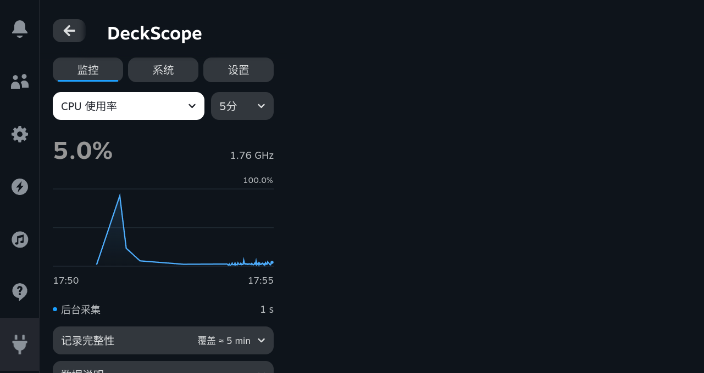
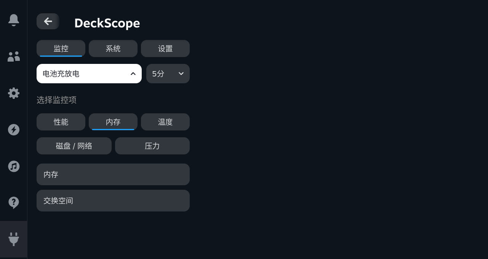

# Single-metric Monitor UI

**Current picker update:** the 18:21 revision replaces the same-screen category controls shown below with [two separate selection levels](TWO-LEVEL-PICKER.md). This record and its hashes remain evidence of the earlier single-chart revision.

**2026-09-12, after the 17:45 density feedback.** The installed development UI now opens with one CPU-usage chart rather than several equally weighted graphs and permanently visible category buttons. This revision changes presentation, not the recorded metric set. The native monitor binary and bridge are unchanged.[1]

## Information hierarchy

| Level | Presentation |
| --- | --- |
| Default view | One selected metric, its current reading and one clearly labelled time-series chart |
| Primary controls | One horizontal row containing the metric and time-range selectors |
| Metric selection | An inline categorized picker replaces the chart while open; all 19 metrics remain available |
| Recording context | A short sampling status and an estimated-coverage summary |
| Optional detail | Integrity rows, unknown gaps, event markers and explanatory text are collapsed by default |

The new hierarchy reduces competing content rather than shrinking fonts. Users choose what to inspect before seeing the detailed data. The picker stays inside QAM; it does not open a fullscreen route or a Steam main-window popup. Native buttons and gamepad focus styling remain in use. No touch-action override, nested scrolling container or host patch was added.

## Data and interaction semantics

Only the selected metric is queried for chart history. Background Zig collection still records all supported metrics. Existing timestamps, coverage estimates, missing-value gaps, percent scales and signed battery-power semantics remain intact. Explanatory notes remain visible when a selected metric needs them, including the SSD cache interval and PSI interpretation.

A selected metric or range closes its picker and restores focus to the corresponding trigger. This focus restoration happens only after an explicit choice, never in response to incoming samples. Integrity and explanatory content are removed from the focus tree while collapsed.

## Validation

Actual Galileo/SteamOS QAM checks selected **all 19 metrics**, confirmed one canvas after each choice, switched the range, and expanded/collapsed integrity details. The collapsed Monitor contained five controls, excluding the three application-level view tabs. Separate CEF directional-key checks reached all enabled main-view controls and exercised range selection, a category/metric choice, focus return, and integrity expansion.[2] [3] [4]

The installed frontend SHA-256 is `1a26196d8f62b2dba27483eba2b576c28e619de849d0c5af7b9395150be3ed7e`. The monitor SHA-256 remains `6cfdb8ec2113003dcdc63168fc760137946dcc78138c3fbdf31110f78b74e0cb`. After closing QAM, live pushes were off and persistence reported no error. The owned inhibitor and tunnel were released.[1]

Local checks cover 46 Zig tests, 42 Python tests against each native build, and 25 frontend/tooling tests, including single-chart rendering, all metric labels in both locales and collapsed defaults. Actual screenshots are Chinese. Physical-controller, touchscreen, cross-device and long-duration performance claims are outside this visual revision.

This revision is committed in the repository. Existing named rc.3 ZIP archives and older acceptance screenshots are historical; build from the current checkout for the new UI. No new source/install archive is provided as a separate user deliverable.

## References

[1]: monitor-focus/identity.json "Installed artifacts and post-close state"
[2]: monitor-focus/functional.json "All-metric selection and collapsed-state checks"
[3]: monitor-focus/dpad.json "All-main-views directional-key traversal"
[4]: monitor-focus/picker-keys.json "Picker focus restoration and disclosure input"
