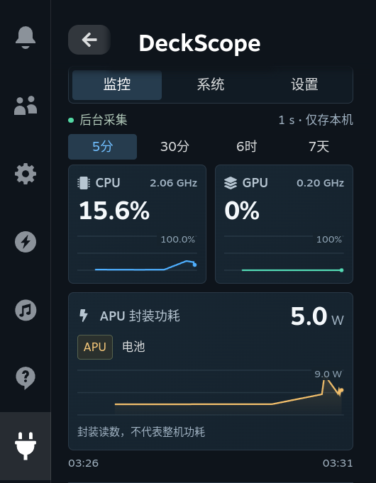
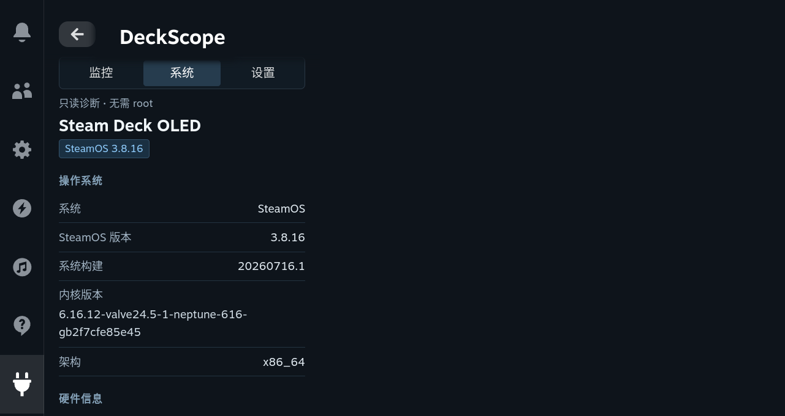
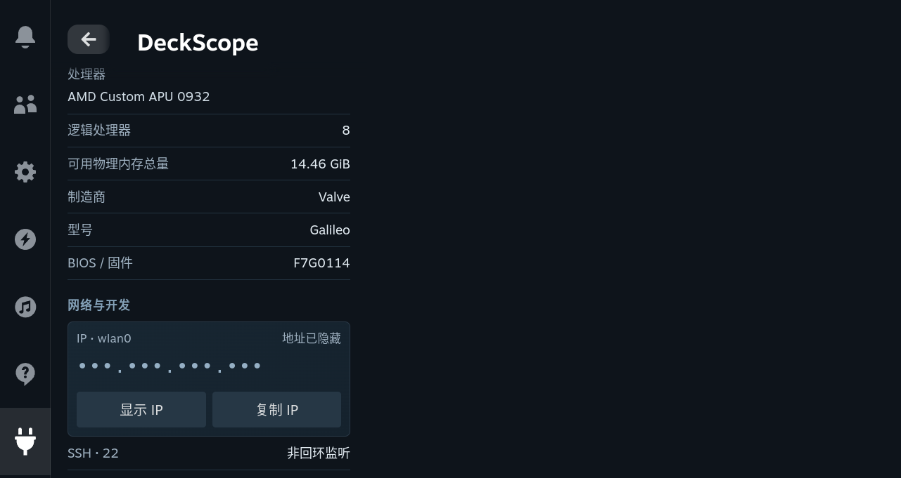

# DeckScope QAM-only 候选版验收

**日期：2026-09-12，UTC+8。版本：0.1.0-rc.1。结论：QAM 改版已侧载并通过本轮功能性验收，尚未公开发布。**

## 结果概述

本轮将产品收敛为 QAM-only。旧 `Page.tsx`、`Timeline.tsx` 和 `/deckscope` 路由已移除。监控、系统和设置均在 Decky 侧栏内完成。CPU/GPU 并排曲线、APU/电池功率曲线、系统版本与内核信息均已在实际 Steam CEF 界面检查，不是静态设计图或模拟数据。

设备为 Steam Deck OLED（Galileo），SteamOS 3.8.16，系统构建 20260716.1，Decky Loader v3.2.8。其他机型和系统通道没有在本轮获得真机认证。机器可读的实测结果与原图哈希保存在 [验收证据](qam/evidence.json)。[1]

## 本地回归

| 检查 | 结果 |
| --- | --- |
| Zig 单元测试 | 22 项通过 |
| ReleaseSmall 二进制的 Python 回归 | 26 项通过 |
| 带运行时检查的 ReleaseSafe 二进制回归 | 26 项通过 |
| 前端纯逻辑与契约测试 | 10 项通过 |
| TypeScript 与 Rollup | 通过 |
| 候选包一致性 | 通过；与开发包字节一致 |
| 公共发布预检 | 按预期失败；许可证、仓库、商店构建与展示图等缺项没有被忽略 |

统一命令为 `bash scripts/check.sh`。新增覆盖包括 CPU 型号解析、敏感标识排除、实时轨迹有界性、同时间戳替换、时钟回拨、真实时间范围、缺失点、百分比刻度、负电池功率，以及陈旧发布包和版本不一致检测。该结果不等价于真实性能基准。

## 实际 QAM 验收

| 项目 | 观察与结论 |
| --- | --- |
| 三条图表 | 同时渲染 CPU、GPU、功率曲线；间隔读取时三块 Canvas 的内容均有更新，原生样本计数继续递增 |
| 时间范围 | 实际切换至 7 天并返回 5 分钟；曲线仍存在，未补造设备没有记录过的日期 |
| 功率来源 | APU 与电池按钮可切换；文字明确区分封装功耗、充放电功率和整机功耗 |
| 系统信息 | SteamOS 版本、构建、完整内核字符串、架构、CPU 型号、逻辑 CPU、内存、制造商、型号、BIOS 均能读取 |
| 隐私与复制 | 实际显示 IP 后重新隐藏；系统摘要复制成功；归档截图保留遮罩，不记录实际地址 |
| 设置 | 通过实际 QAM 控件切换 1 秒→2 秒→1 秒，并从后端回读确认；结束时隐私遮罩开启 |
| 原生焦点 | 方向键与确认键可切换视图；逐项聚焦 OS、版本、构建、内核、架构、CPU、逻辑 CPU、内存、制造商、型号、BIOS，长页面随焦点滚动 |
| monitor 恢复 | 单次向本插件 monitor 发送 TERM；原生进程重新启动，live_push 恢复为 true，界面文本继续变化 |
| 关闭 QAM | live_push 变为 false，后台样本计数仍继续递增 |
| 设备产物 | 最终安装的二进制与前端 SHA-256 均与本地产物一致；当前日志出现 `monitor ready` |

方向键与确认操作通过 CEF 的合成键盘输入执行，不应写成实体手柄测试。原生退出注入只作用于本插件，不代表电源故障、内核崩溃或真实休眠恢复测试。IP 测试只证明本机字段显示，不证明外部客户端能连接 SSH/CEF。[1]

## 验收中修复的问题

| 实测问题 | 修复 |
| --- | --- |
| 功率切换按钮沿用原生默认全宽，第二个按钮溢出 | 采用 QAM 局部分段按钮样式和明确的宽度约束 |
| 首屏时间轴被底部裁切 | 调整两类曲线高度，将三条曲线与共享时间轴完整保留在首屏 |
| 原生 Dropdown 在主视窗打开选项并隐藏 QAM | 采样间隔改为 QAM 内的四个分段按钮 |
| 普通 Focusable 容器没有实际进入焦点树 | 根据实机组件行为，为只读信息行显式传入原生 `focusable: true`；没有添加无效的点击动作 |
| 操作按钮默认最小宽度造成横向滚动 | 对插件内操作按钮设置可收缩宽度与最小宽度；保留原生焦点高亮 |
| 直接替换前端受到 root-owned 文件权限限制 | 停止直接写入；用户随后授权持续侧载，改用既有完整 sudo 安装和备份流程，未放宽文件权限 |

## 产物身份

| 文件 | 大小 | SHA-256 |
| --- | ---: | --- |
| `bin/deckscope-monitor` | 128,000 字节 | `d8156e01d2c53ec9b1d116de0b3ea8cc3ee814e710940ac9a985ad9c4d8916bb` |
| `dist/index.js` | 49,142 字节 | `b044d7bcf8c1c4f33119150b8e4726614b83e3e76101d9bdcce83c787581cb09` |
| `DeckScope-0.1.0-rc.1.zip` | 以归档文件为准 | `63afb51aa31acf2be59dbc4adbed2f75202038e7b679786e99b12eca28b62c61` |

监控预览只移除了原图右侧没有 UI 内容的空白，没有改绘任何数值或曲线。`docs/qam/` 中同时保留原始完整截图和其他视图。

## 收尾与剩余边界

已关闭插件面板，确认后台仍记录但不再实时推送。结束配置为 1 秒采样、IP 隐私遮罩开启。03:35:14 已主动停止本轮临时防休眠服务并关闭任务专属 SSH/CEF 隧道，没有留下依赖本会话的后台调试任务。设备可以恢复正常休眠。[1]

本轮没有测试 LCD、非 Deck SteamOS、真实睡眠/唤醒、切换网络、实体手柄、同步电功率精度、长稳或游戏帧时间影响。没有创建公开仓库、推送 Git、打 tag、上传公开 Release 或提交商店。**正式发布的剩余要求见 [发布准备](RELEASE.md)**，不能把本次候选版验收直接当成商店批准或生产认证。

## References

[1]: qam/evidence.json "DeckScope QAM-only device observations, lifecycle checks and screenshot hashes, 2026-09-12"
