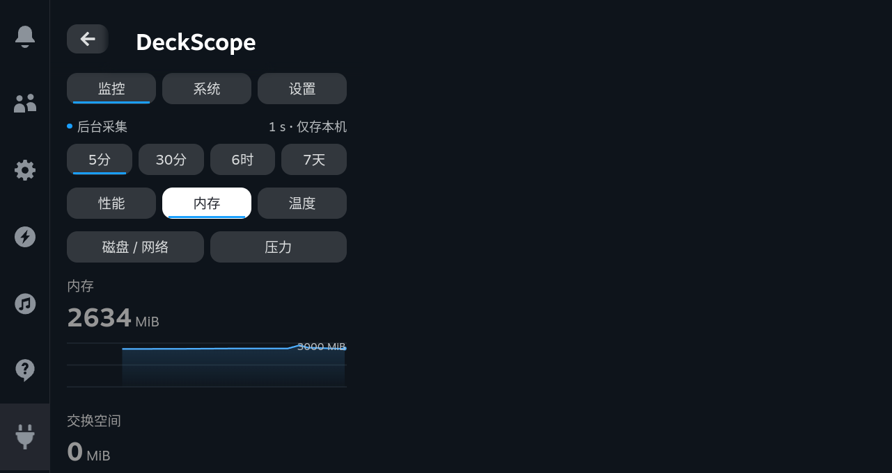
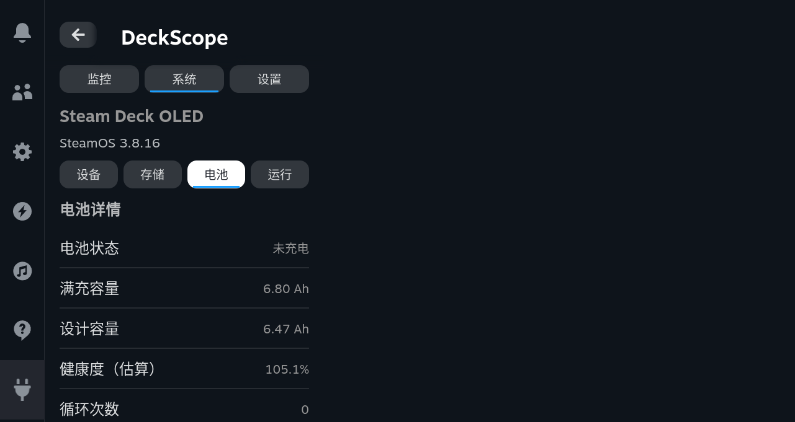
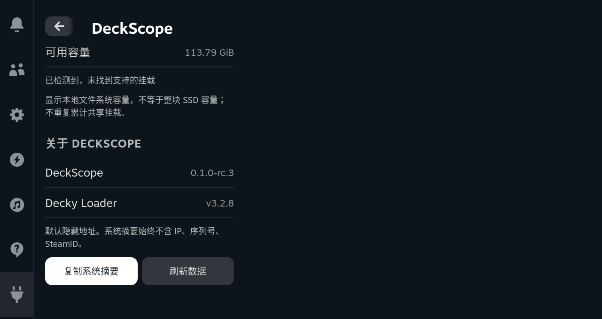
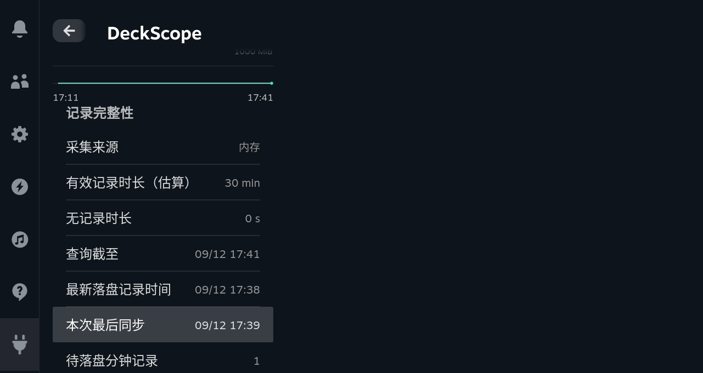

# rc.3 Device Acceptance

**Date: 2026-09-12, UTC+8. Target: Galileo / Steam Deck OLED.** The revised `0.1.0-rc.3` candidate is installed. Its QAM pages, grouped curves, system snapshots and CEF directional-key navigation pass the checks described below. This is a private-device acceptance record, not a public release or a physical-controller certification.[1] [2]

## Installed identity

The user confirmed that the device was idle and authorized sideloading and acceptance at 17:23. The complete sudo-backed installer retained the previous plugin before each replacement. It did not erase settings or history. The revised install reported `monitor ready` at 17:30:07. The Loader was active when inspected. The installed entry point, plugin metadata, frontend bundle and native monitor hashes match local artifacts.[1]

| Artifact | Identity |
| --- | --- |
| Candidate ZIP | `DeckScope-0.1.0-rc.3.zip` |
| ZIP SHA-256 | `9453bf0641f4e746a301c2c617442d0a06f18112c3ccecb419f58f5e7eb49a4a` |
| Native SHA-256 | `6cfdb8ec2113003dcdc63168fc760137946dcc78138c3fbdf31110f78b74e0cb` |
| Frontend SHA-256 | `041ffe041c4eb745ac1323fcd03452fe2cd2dc7d4308b17e2f107a74688095b0` |
| Native binary | 157,656 bytes, stripped x86-64 Linux executable |
| SteamOS kernel | `6.16.12-valve24.5-1-neptune-616-gb2f7cfe85e45` |
| Decky Loader | v3.2.8 |

The pre-install [isolated snapshot](features/rc3-native.json) documents the earlier candidate build. It is historical evidence, not the identity of this revised installed package. Both builds carry the private rc.3 version string; hashes distinguish them.

## Functional results

| Area | Observed result | Boundary |
| --- | --- | --- |
| Monitor groups | Memory rendered 2 charts, Thermal 4, Disk/Network 4 and PSI 5 | No electrical accuracy or performance benchmark is implied |
| Rendering | All inspected canvases had positive dimensions; no plugin error panel or horizontal control overflow was found | Screenshots cover viewport states, not every possible locale/data value |
| Storage | Mounted btrfs system and ext4 user-data capacity displayed; an SD/removable device was detected without a supported mount | No card insertion, mount or unmount was performed |
| Battery | Charge-based capacities, 105.1% driver-derived ratio, zero reported cycles and voltage rendered | Ratio is not a lifespan assessment; zero is the driver's report |
| Runtime | OS elapsed, awake and suspended durations were separate; load, cache, Swap, zram and zswap fields were available | These are boot-relative system counters, not collector uptime |
| Coverage | A 30-minute PSI query returned minute aggregates plus recent raw support; the revised query reported 1,800,000 ms covered and 0 ms uncovered | Resolution-based estimate, not exact continuous-duty measurement |
| Collection | Sample count advanced from 39 to 52 during the functional check | Short functional observation only |
| Live lifecycle | Switching from Monitor to System disabled live pushes without stopping recording | QAM was closed at the end of interaction checks |

Functional data and rendered text are recorded in [functional.json](rc3/functional.json). The exact query timestamp and record counts are preserved there rather than rounded into a durability claim.[2]

## Problems found and corrected

The first installed build computed Mid/Low coverage only from completed aggregate records. Incoming live points could therefore appear inside a gray trailing “No data” region. The same implementation excluded an aggregate whose timestamp preceded the query start even when its support overlapped the requested range. The revised implementation unions recent valid raw-sample support with the selected aggregate tier and clips boundary overlaps. It sorts and unions intervals, so duplicates do not count twice. Missing values remain missing and large gaps are not backfilled.[2] [3]

The revised response reports recent support separately as `live_records`. Its observed 30-minute result contained 34 source/valid aggregate records and 45 recent raw records. That count is not the chart's point count: chart decimation and coverage are separate operations. The response contained no detected suspend events; old gaps were not retroactively labeled suspend.[2]

A separate formatting issue displayed a 59-second uncovered interval as `0 min`. Positive durations below one second now show `<1 s`; durations below one minute show seconds. Unit regressions cover zero, subsecond, 59-second and one-minute values. The tested native coverage regression covers both a pending aggregation tail and a query-start overlap.[3] [4]

## Directional-key navigation

The project-owned main navigation test reached Monitor, System and Settings and reported no missing enabled control. A separate bounded traversal visited each new group and each new System subview. It reached every native information row and the bottom action region.[5] [6]

| Subview | Visited focus positions | Missing required rows |
| --- | ---: | ---: |
| Memory | 11 | 0 |
| Thermal | 11 | 0 |
| Disk / Network | 11 | 0 |
| PSI | 11 | 0 |
| Storage | 10 | 0 |
| Battery | 10 | 0 |
| Runtime | 19 | 0 |

System pages correctly land on the left summary button when moving down. Right moves to Refresh and Left returns to the summary button. The first version of the acceptance script incorrectly expected a vertical-only walk to reach the right-hand button. That assertion was corrected; the plugin's correct horizontal grouping was not changed. The existing IP action pair also remained reachable in the all-controls traversal.[5] [6]

These inputs were CEF key events, not a physical D-pad. The touchscreen investigation remained stopped as previously requested. No host focus patch, touch-action override or nested scroller was introduced.

## Natural persistence observation

The one-shot normal-batch check completed without a forced flush or setting change. The monitor had collected 594 samples and live pushes were off. The latest successful sync was **17:39:46.269 UTC+8**, covering the aggregate timestamped **17:38:46.258**. Pending minute records were zero at that observation; neither metric persistence nor event persistence reported failure.[7]

A subsequent independent file scan found **420 valid minute records** across two day files (124 and 296). Both headers and all record CRCs passed. There were no partial tails or CRC failures. This proves the observed normal write/read path, not recovery after sudden power loss.[7]

The real QAM integrity panel was then reopened. It displayed 30 minutes of estimated memory coverage, zero uncovered seconds, the 17:38 latest-record timestamp and the 17:39 sync time. One newly completed minute was pending by this later screenshot, which is expected between batches. The task then closed QAM and successfully released the owned sleep inhibitor and SSH tunnel. No permanent device setting was changed.

## Local regression and limits

The revised code passes **46 Zig unit tests**, **42 Python tests against each of ReleaseSmall and ReleaseSafe**, and **22 frontend/tooling tests**, plus TypeScript, Rollup and package checks. The installed UI checks are additional evidence, not a replacement for local regression.

Actual suspend/resume marker capture, card mount transitions, physical input, long-running stability, game-frametime impact and non-OLED compatibility remain untested in this session. English strings have local regression coverage; this device's screenshots and interactive checks were in Chinese. Public-release blockers remain listed in [Release Preparation](RELEASE.md).

## References

[1]: rc3/identity.json "Installed hashes and original screenshot identities"
[2]: rc3/functional.json "Installed rc.3 functional observations"
[3]: ../monitor/src/history_coverage.zig "Coverage union and boundary regression"
[4]: ../tests/ui.test.mjs "Duration and frontend regression tests"
[5]: rc3/dpad.json "All-main-views CEF directional-key traversal"
[6]: rc3/subviews.json "New subviews and horizontal action-pair traversal"

[7]: rc3/persistence.json "Normal batch sync and independent history CRC verification"
