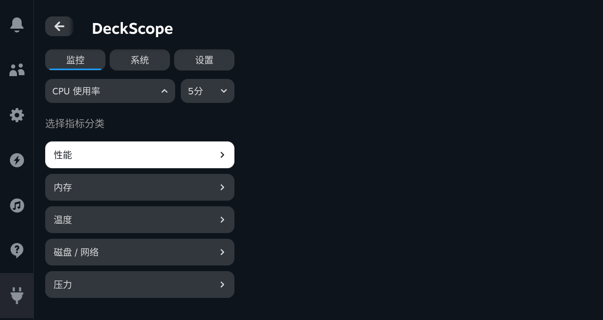
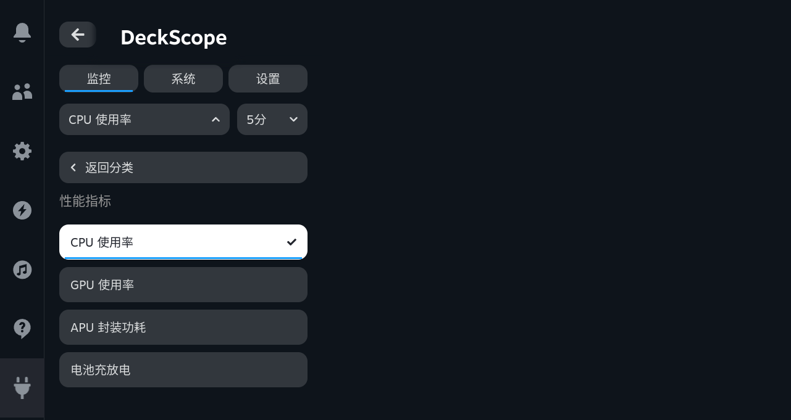

# Two-level Metric Picker

**2026-09-12, after the 18:21 implementation request.** Metric selection now separates category navigation from choosing a concrete metric. Category and metric buttons are never displayed together. The single-chart Monitor default and all 19 supported metric choices remain unchanged.[1]

## Interaction model

| State | Visible content | Meaning |
| --- | --- | --- |
| Category level | Five category rows, each with a right chevron | Enter a category; do not change the selected metric |
| Metric level | Back-to-categories button, category-specific heading, concrete metrics | Choose a metric; a checkmark identifies the current selection |
| Closed | Current metric trigger and one chart | Monitor the selected metric |

Opening the picker goes directly to the selected metric's category and focuses that metric. For example, CPU usage opens the Performance metrics level. Back to categories restores focus to the category just left. Entering another category focuses its selected metric, or its first metric if the current selection belongs elsewhere. Selecting a metric closes the picker and returns focus to its trigger.

Closing the picker without choosing a metric discards the browsing location. Reopening returns to the selected metric's category, not the uncommitted category. Focus changes occur only on explicit navigation. Incoming samples do not move focus. The native QAM scroller and control styling remain unchanged.

## Validation

Installed Galileo checks traversed all five categories and selected/reopened all 19 metrics. Assertions confirmed mutually exclusive levels, correct checkmarks, automatic entry into the selected category, focus restoration and preservation of the previous selection after cancellation.[1]

A separate CEF directional/Enter sequence passed 15 checks. It exercised returning to categories, switching from Performance to Memory, selecting Swap, reopening at the selected metric, returning to CPU and the time-range selector. The general three-view D-pad audit also passed. Its scanner was corrected to record controls reached on its leftward pass; Steam can remember the right-hand control as a horizontal group's entry point. The earlier scanner missed the CPU trigger despite reaching it while returning left.[2] [3]

Local regression covers the unchanged 46 Zig tests, 42 Python tests against each native build, and 28 frontend/tooling tests. Both English and Simplified Chinese component-state tests verify that category navigation does not commit a metric. Actual screenshots and CEF input checks use Chinese. These results do not certify physical-controller or touchscreen behavior.

The installed frontend SHA-256 is `2f1066465d9bbcc94187da95fc46c75cee06a06a1288567d6c6500fc97a87ccb`. The native monitor and bridge are unchanged. After QAM closed, live push was off and no persistence error was reported. The temporary inhibitor and SSH tunnel were released.[4]

## References

[1]: two-level/functional.json "All-category and all-metric selection evidence"
[2]: two-level/keys.json "Two-level directional and confirmation input"
[3]: two-level/dpad.json "Main-view directional-key audit"
[4]: two-level/identity.json "Installed hashes and post-close state"
