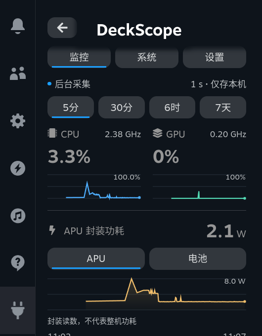
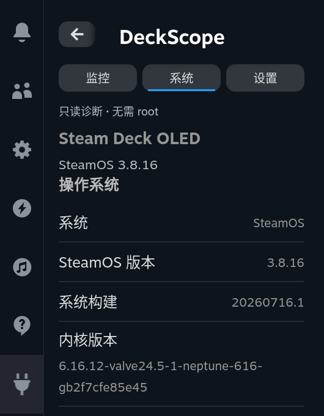

# rc.2 Native UI and Input Acceptance

> **Historical status:** This document records private `0.1.0-rc.2` acceptance on Galileo on 2026-09-12. It is not current release acceptance. For the current self-contained procedure, see [DEBUGGING.md](DEBUGGING.md).

**2026-09-12, UTC+8. The current `0.1.0-rc.2` was sideloaded to Galileo. Navigation across both horizontal button groups passed acceptance in the actual Steam CEF environment. The originally reported touch-input obstruction was not reproduced consistently and cannot be marked as definitively resolved.**

## 11:16 Scope Update and D-pad Reverification

The user observed that other plugins appeared to exhibit touch-screen problems as well and explicitly requested that touch-screen investigation stop. The current acceptance requirement is D-pad access to all views and enabled controls. This observation does not prove that the host is the root cause of the failure. No plugin UI, scrolling logic, or system configuration was changed in this round, and the plugin was not sideloaded again.

At 11:20, the actual QAM was used with CEF directional and confirm keys to switch between “Monitor → System → Settings” and to navigate back to the navigation bar from the bottom of a page. The Monitor page covered all time ranges, the APU/battery switch, information rows, and the refresh chart. The System page covered hardware, connection, and source information rows, together with both groups of action buttons. The Settings page covered all sampling intervals, the privacy toggle, historical status, and the refresh control at the bottom of the page. All enabled action buttons were reachable. This round traversed focus only; it did not execute copying, toggle privacy, or change sampling settings. Evidence is available in [the D-pad trace](native-ui/dpad-accessibility.json). These were CEF-synthesized key presses and do not represent a physical-controller test.

The touch-screen issue remains a known limitation and is no longer a target for further fixes in this round. QAM was closed, the temporary sleep inhibitor was removed, and the debugging tunnel was closed. The earlier rc.2 acceptance process is retained below.

## Changes

Gradient cards, custom button background colors, focus outlines, and the branded footer were removed. System information now uses Decky’s `Field`, `PanelSection`, and `PanelSectionRow`, while retaining the native fonts, spacing, buttons, and focus behavior. Charts still retain real CPU, GPU, and power data; static images are not used as substitutes.

“Hide/show IP,” “Copy IP,” “Copy system summary,” and “Refresh data” previously used only a CSS flex layout and had no native horizontal focus container. Both groups now use `Focusable flow-children="horizontal"`. This round did not change their business actions, the default privacy setting, or the summary data contents.

## Measured Results

| Scenario | Actual result |
| --- | --- |
| Hide IP → Right → Left | Focus first moved to “Copy IP,” then returned to “Hide IP.” |
| Copy system summary → Right → Left | Focus first moved to “Refresh data,” then returned to “Copy system summary.” |
| Both button layouts | No horizontal overflow. |
| System page: drag after directional-key focus | After an upward drag, the scroll position increased by 224 CSS px; there was no reverse jump exceeding 2 px. |
| Monitor page: drag after directional-key focus | The scroll position increased by approximately 231.3 CSS px; there was no reverse jump while the live temperature changed. |
| Diagonal drag beginning inside a chart | The scroll position increased by 226 CSS px; there was no reverse jump. |
| Privacy setting | IP was temporarily hidden for the screenshots and the user’s original setting was restored afterward. |
| Installation identity | The device’s final binary and frontend SHA-256 hashes matched the local values. |
| Cleanup | QAM was closed, and the temporary sleep inhibitor and SSH/CEF tunnels were removed. |

Keys were sent as CEF-synthesized directional keys. Drags used stepped `Input.dispatchTouchEvent` calls. These are not subjective acceptance tests using a physical controller or a finger on the touchscreen. The original results and screenshot hashes are included in the machine-readable evidence.[1]

## Precise Boundary of the Touch-Screen Issue

In this round, the old version also did not consistently reproduce the user-described obstruction during ordinary dragging, dragging after directional-key use, dragging that began inside a chart, or diagonal dragging. Therefore, the passing results from the corrected version cannot be used to infer that the root cause of the original issue has been found.

The final version removed the chart card’s redundant `overflow:hidden` and retained one of Steam’s own scroll containers. It did not add a `touchmove` interceptor, forced `scrollTop`, or focus rollback. Explicit `touch-action:pan-y` was tried during diagnosis, but it prevented the page from moving during an actual CEF diagonal test and was therefore reverted. The final version does not override Steam’s touch strategy.

Before the 11:16 scope update, physical-finger retesting at the affected locations remained outstanding. That work is no longer requested. The issue must not be relabeled as resolved or used to justify further touch workarounds without new authorization.

## Local Regression and Version Scope

The final code passed 22 Zig unit tests, 26 Python integration tests, with `ReleaseSmall` and `ReleaseSafe` each run once, 12 frontend tests, and TypeScript, Rollup, and complete-package checks. The new frontend tests verify the component structure of shared controls to prevent the button pairs from regressing to visual side-by-side placement only. They also verify that there is no custom focus skin, nested scrolling, or touch-strategy override.

This round contained fixes for a private candidate build only; it was not publicly released. Store builds, licensing, and other release omissions remain covered by the [release notes](RELEASE.md). Native collection logic and the historical format were unchanged; the monitor only synchronized the version number.

## References

[1]: native-ui/evidence.json "DeckScope rc.2 focus pairs, synthetic touch traces, privacy restoration and artifact hashes"
